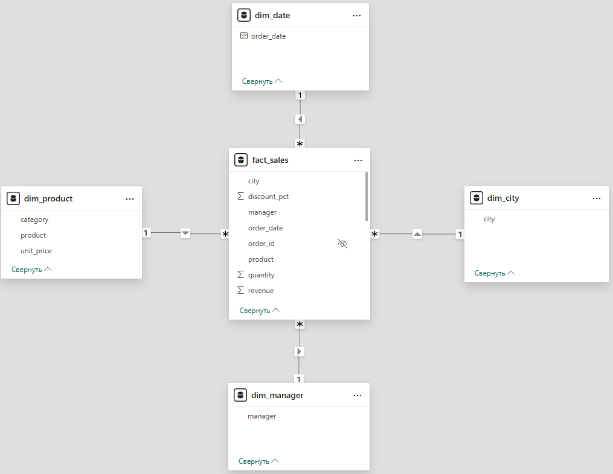

# Q1 2026 Sales Analysis | Excel, Power Query, DAX, Power BI

## О проекте
Портфельный end-to-end проект по анализу продаж за **Q1 2026** на synthetic dataset.

Проект показывает базовый рабочий цикл аналитика данных:
- работа с исходными данными в Excel;
- подготовка и очистка данных в Power Query;
- построение модели данных;
- создание мер на DAX;
- сборка dashboard в Power BI.

## Цель проекта
Собрать портфельный проект, который демонстрирует полный базовый цикл аналитической работы: от исходного датасета до аналитической модели и dashboard.

## Стек
- Excel
- Power Query
- Power BI
- DAX

## Что сделано
- подготовлен synthetic sales dataset за Q1 2026;
- выполнена базовая очистка и подготовка данных в Power Query;
- построена модель данных для анализа продаж;
- созданы базовые DAX-меры для KPI и аналитических разрезов;
- собраны 2 страницы отчёта:
  - **Q1 2026 Sales Overview**
  - **Manager Performance Analysis**

## Data Model

В проекте используется базовая аналитическая модель с разделением на факт и измерения.

### Таблицы модели
- `fact_sales` — фактовая таблица продаж
- `dim_date` — календарная таблица
- `dim_city` — справочник городов
- `dim_manager` — справочник менеджеров
- `dim_product` — справочник товаров и категорий

### Логика модели
- `fact_sales` хранит транзакционные данные;
- измерения используются для аналитических разрезов;
- модель построена по базовой star-like логике для последующего анализа в Power BI.

### Схема модели


## Основные DAX-меры

Ниже приведены ключевые меры, использованные в проекте.

### Revenue
```DAX
Revenue =
SUM(fact_sales[revenue])
```

### Sales Count
```DAX
Sales Count =
COUNTROWS(fact_sales)
```

### Avg Revenue per Sale
```DAX
Avg Revenue per Sale =
DIVIDE([Revenue], [Sales Count])
```

### Avg Revenue per Unit
```DAX
Avg Revenue per Unit =
DIVIDE([Revenue], SUM(fact_sales[quantity]))
```

### Manager Revenue Share
```DAX
Manager Revenue Share =
DIVIDE(
    [Revenue],
    CALCULATE(
        [Revenue],
        ALL(dim_manager[manager])
    )
)
```

## Структура отчёта

### 1. Q1 2026 Sales Overview
Overview-страница для управленческого обзора продаж за квартал.

Содержит:
- общую выручку;
- количество продаж;
- среднюю выручку на продажу;
- среднюю выручку на единицу товара;
- выручку по категориям;
- выручку по городам;
- выручку по менеджерам;
- динамику выручки по месяцам;
- доли городов и менеджеров в общей выручке.

### 2. Manager Performance Analysis
Детальная страница по анализу результативности менеджеров.

Содержит:
- выручку выбранного менеджера;
- долю менеджера в общей выручке;
- количество продаж;
- среднюю выручку на продажу;
- сравнение менеджеров между собой;
- структуру выручки выбранного менеджера по категориям;
- динамику выручки по месяцам;
- детальную таблицу по категориям.

## Ключевые выводы

> Датасет synthetic, поэтому выводы ниже носят демонстрационный характер и показывают логику аналитического разбора, а не реальные бизнес-факты компании.

- Наибольшую выручку в текущем наборе данных формируют категории **Dairy** и **Beverages**, при этом **Snacks** уступает им по вкладу.
- Среди городов лидирует **Novosibirsk**, но разрыв между городами не критический: структура выручки распределена относительно умеренно.
- Среди менеджеров лучший результат показывает **Olga**, за ней следуют **Anna** и **Elena**.
- Месячная динамика внутри квартала неравномерна: в **феврале** наблюдается заметная просадка по сравнению с январём и мартом.
- Detail-страница показывает, что performance отдельного менеджера формируется не только количеством продаж, но и структурой категорий.
- Overview-страница отвечает на вопрос **«что происходит в целом»**, а страница **Manager Performance Analysis** — **«за счёт чего формируется результат конкретного менеджера»**.

## Ключевые навыки, которые показывает проект
- подготовка исходных данных в Power Query;
- построение базовой star-like логики модели;
- создание KPI и аналитических мер в DAX;
- работа с filter context;
- проектирование overview и detail страниц отчёта;
- упаковка аналитического результата в понятный dashboard.

## Скриншоты

### Overview Dashboard


### Manager Performance Analysis


## Дополнительные скриншоты
- [KPI Section](screenshots/kpi_section.png)
- [Manager Breakdown Section](screenshots/manager_breakdown_section.png)

## Структура репозитория
- `data/` — исходный synthetic dataset
- `pbix/` — Power BI файл проекта
- `screenshots/` — скриншоты dashboard
- `docs/` — дополнительные материалы по проекту

## Файлы проекта
- `data/synthetic_sales_dataset_q1_2026.xlsx`
- `pbix/q1_2026_sales_analysis.pbix`

## How to Reproduce

1. Скачать или клонировать репозиторий.
2. Открыть файл `pbix/q1_2026_sales_analysis.pbix` в Power BI Desktop.
3. При необходимости перепривязать путь к Excel-источнику из папки `data/`.
4. Обновить данные через **Refresh**.
5. Открыть страницы:
   - `Q1 2026 Sales Overview`
   - `Manager Performance Analysis`

### Требования
- Power BI Desktop
- доступ к файлу `data/synthetic_sales_dataset_q1_2026.xlsx`

## Limitations / Assumptions
- Датасет synthetic и используется только в учебно-портфельных целях.
- Анализ ограничен периодом **Q1 2026**, поэтому здесь нет длинной временной динамики и полноценной сезонности.
- В проекте нет метрик прибыли, маржи, возвратов и customer-level аналитики.
- Модель и выводы ориентированы на демонстрацию базового аналитического цикла, а не на production-аналитику.
- Страница Manager Performance Analysis показывает логику detail-разбора performance менеджера на ограниченном наборе данных.

## Итог
Проект оформлен как первый портфельный BI-кейс и показывает базовую готовность к работе с:
- Excel-источником;
- очисткой данных;
- моделью;
- DAX;
- Power BI dashboard.

Следующий шаг в развитии портфолио — проект на связке **SQL + Python (Pandas) + Power BI**.
