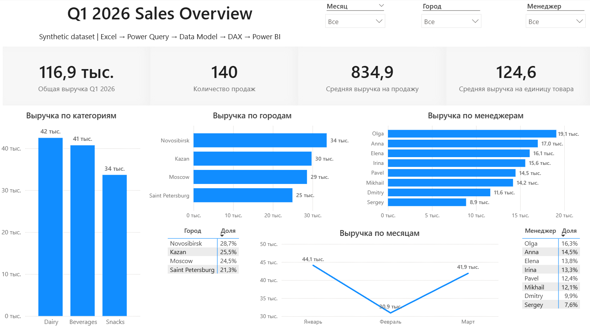
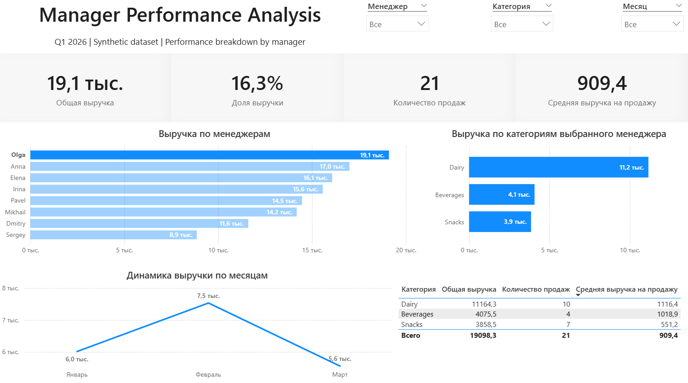

# Q1 2026 Sales Analysis | Excel, Power Query, DAX, Power BI

## О проекте
Портфельный end-to-end проект по анализу продаж за **Q1 2026** на synthetic dataset.

Проект показывает базовый рабочий цикл аналитика данных:
- работа с исходными данными в Excel;
- подготовка и очистка данных в Power Query;
- построение модели данных;
- создание мер на DAX;
- сборка dashboard в Power BI.

## Цель проекта
Собрать портфельный проект, который демонстрирует полный базовый цикл аналитической работы: от исходного датасета до аналитической модели и dashboard.

## Стек
- Excel
- Power Query
- Power BI
- DAX

## Что сделано
- подготовлен synthetic sales dataset за Q1 2026;
- выполнена базовая очистка и подготовка данных в Power Query;
- построена модель данных для анализа продаж;
- созданы базовые DAX-меры для KPI и аналитических разрезов;
- собраны 2 страницы отчёта:
  - **Q1 2026 Sales Overview**
  - **Manager Performance Analysis**

## Структура отчёта

### 1. Q1 2026 Sales Overview
Overview-страница для управленческого обзора продаж за квартал.

Содержит:
- общую выручку;
- количество продаж;
- среднюю выручку на продажу;
- среднюю выручку на единицу товара;
- выручку по категориям;
- выручку по городам;
- выручку по менеджерам;
- динамику выручки по месяцам;
- доли городов и менеджеров в общей выручке.

### 2. Manager Performance Analysis
Детальная страница по анализу результативности менеджеров.

Содержит:
- выручку выбранного менеджера;
- долю менеджера в общей выручке;
- количество продаж;
- среднюю выручку на продажу;
- сравнение менеджеров между собой;
- структуру выручки выбранного менеджера по категориям;
- динамику выручки по месяцам;
- детальную таблицу по категориям.

## Ключевые навыки, которые показывает проект
- подготовка исходных данных в Power Query;
- построение базовой star-like логики модели;
- создание KPI и аналитических мер в DAX;
- работа с filter context;
- проектирование overview и detail страниц отчёта;
- упаковка аналитического результата в понятный dashboard.

## Скриншоты

### Overview Dashboard

### Manager Performance Analysis

## Дополнительные скриншоты
- [KPI Section](screenshots/kpi_section.png)
- [Manager Breakdown Section](screenshots/manager_breakdown_section.png)

## Структура репозитория
- `data/` — исходный synthetic dataset
- `pbix/` — Power BI файл проекта
- `screenshots/` — скриншоты dashboard
- `docs/` — дополнительные материалы по проекту

## Файлы проекта
- `data/synthetic_sales_dataset_q1_2026.xlsx`
- `pbix/q1_2026_sales_analysis.pbix`

## Итог
Проект оформлен как первый портфельный BI-кейс и показывает базовую готовность к работе с:
- Excel-источником,
- очисткой данных,
- моделью,
- DAX,
- Power BI dashboard.

Следующий шаг в развитии портфолио — проект на связке **SQL + Python (Pandas) + Power BI**.
